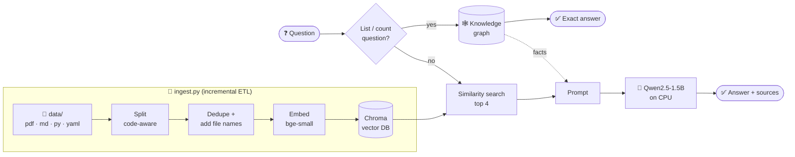

<div align="center">

# 🚁 LRS-Nav Docs Assistant

### RAG + Knowledge Graph over a research codebase, fully local on CPU


**Recall@4 = 0.93  ·  MRR = 0.72  ·  No API keys  ·  No GPU**

</div>

---

## ✨ What it does

Ask questions about a multi-agent reinforcement-learning project (code, configs and report) and get answers **with their sources**.

| | Feature | How |
|---|---|---|
| 🧹 | **Data preparation** | Python ETL: load → code-aware split → dedupe → embed → Chroma |
| 🔁 | **Incremental ingestion** | SHA-256 fingerprint per file, so only new or changed files are re-embedded |
| 🕸️ | **Knowledge graph** | Exact answers to list/count questions, plus GraphRAG context |
| 📏 | **Retrieval evaluation** | 15 labelled questions, scored with Recall@k and MRR |
| 💬 | **Chat UI** | Streamlit, with the sources shown for every answer |

---

## 🏗️ Architecture



---

## 📊 Results

| Retrieval method | Recall@4 | MRR |
|---|:---:|:---:|
| ✅ **Similarity search** (used) | **0.93** | **0.72** |
| MMR (diversity search) | 0.73 | 0.66 |

> [!NOTE]
> **Recall@4:** was a correct source file in the top 4 results?
> **MRR:** how high was it ranked? (1st = 1.0, 2nd = 0.5, …)

### 🔍 Findings

- 📉 **MMR hurt recall.** It was added to fight duplicate chunks, but once duplicates were removed at ingestion it pushed correct files out. Similarity search was chosen **based on the evaluation**.
- 🏷️ **Test labels need checking too.** One "miss" was a wrong label in the test set, not a retrieval error.
- 🔢 **Vector search can't count.** "Name the envs" first returned a variable name (`extra_dims`), because *envs* also means `num_envs` in the code. The **knowledge graph** now answers these exactly.
- 🤏 **The remaining weakness is generation, not retrieval.** The 1.5B CPU model sometimes ignores extra context even when the right files are found.

### 💬 Example

| Question | Route | Answer |
|---|---|---|
| *"Can you name the envs?"* | 🕸️ Graph | Hovering, Tracking, Waypoint, Figure-8 |
| *"How is the PPO training command built?"* | 🔎 RAG | Built by `build_ppo_command` in `ppo/command.py`… *(with sources)* |

---

## 🚀 Quick start

```bash
# 1. Environment
python -m venv .venv
.venv\Scripts\activate                 # Linux/Mac: source .venv/bin/activate
pip install torch --index-url https://download.pytorch.org/whl/cpu
pip install -r requirements.txt

# 2. Add your documents to data/
#    (optional) copy kg_triples_example.csv -> data/kg_triples.csv and edit the facts

# 3. Run
python ingest.py            # build / update the vector DB
streamlit run app.py        # chat UI
```

<details>
<summary><b>🛠️ All commands</b></summary>

| Command | What it does |
|---|---|
| `python ingest.py` | Build or update the vector DB (incremental) |
| `python ingest.py --rebuild` | Rebuild from scratch |
| `python evaluate.py` | Print Recall@4 and MRR |
| `python kg.py "How many environments are there?"` | Test the knowledge graph |
| `python rag.py "What does the Reviewer agent do?"` | Ask from the terminal |
| `streamlit run app.py` | Start the chat UI |

</details>

<details>
<summary><b>📁 Project structure</b></summary>

```
├── config.py               settings (models, chunk size, top-k, paths)
├── ingest.py               ETL pipeline -> Chroma (incremental)
├── store.py                opens the Chroma vector DB
├── kg.py                   knowledge graph (NetworkX)
├── rag.py                  routing: graph, or vector search + LLM
├── evaluate.py             Recall@k / MRR evaluation
├── app.py                  Streamlit chat UI
├── eval/questions.csv      labelled test questions
├── kg_triples_example.csv  example knowledge-graph facts
└── data/                   private documents (git-ignored)
```

</details>

---

## 🧭 Roadmap

- [ ] ☁️ **Azure version:** Azure OpenAI for generation, Azure AI Search as the vector store
- [ ] ⏰ **Automatic ingestion trigger** (scheduled or event-based, e.g. an Azure Function)
- [ ] 🔌 **MCP server** so agents can query tabular data (e.g. training results) with tools
- [ ] 🗄️ **Neo4j** graph database, with LLM-based triple extraction
- [ ] 📐 **Answer-quality metrics** in addition to retrieval metrics

---

<div align="center">

Built by **Manisha Kasireddy** · M.Sc. Electrical Systems Engineering, Universität Paderborn

</div>